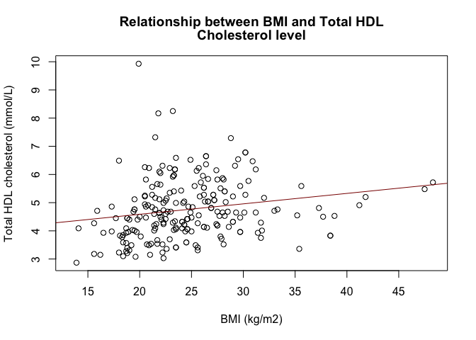
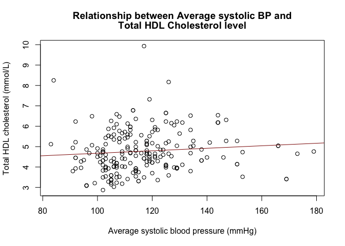
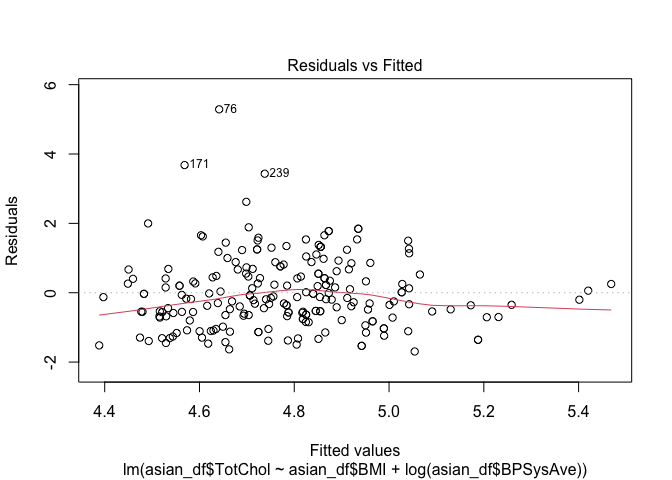
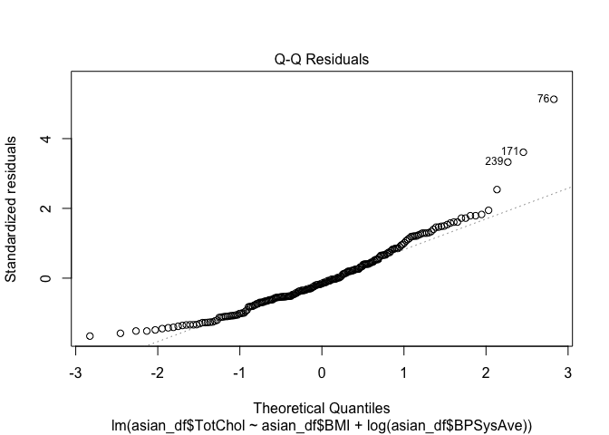

Final Report: HANG TRAN
================

# NHANES PROJECT

## Background/Motivation for the Study

Asian population is one of many underrepresented groups in biology and
medical research since the majority of studies concentrate on the
Caucasian and European groups. Thus, there is a need for a study on the
relationship between BMI index and systolic blood pressure and total of
cholesterol level in the Asian population.

## References

Varbo, Anette, Marianne Benn, George Davey Smith, Nicholas J. Timpson,
Anne Tybjærg-Hansen, and Børge G. Nordestgaard. “Remnant Cholesterol,
Low-Density Lipoprotein Cholesterol, and Blood Pressure as Mediators
From Obesity to Ischemic Heart Disease.” Circulation Research 116, no. 4
(2015): 665–73. <https://doi.org/10.1161/CIRCRESAHA.116.304846>

## Research Question and Hypothesis

The research question is how do the changes in BMI index and average
systolic blood pressure affect the mean response in total cholesterol
levels in the Asian population from the NHANES dataset?

The hypothesis is the increase in both BMI and systolic blood pressure
will cause an increase in the total HDL cholesterol based on historical
studies. The positive linear relationship between BMI and average
systolic blood pressure and total cholesterol levels indicates that
there is likely an association of developing higher HDL cholesterol if
people has higher BMI and average systolic blood pressure.

Data Description and Exploratory Data Analysis

The targeted variables are 3 quantitative variables including Body max
index in kg/m2, Combined systolic blood pressure reading in mmHg, and
Total HDL cholesterol in mmol/L. The sample are the people who identify
themselves as Asian in the NHANES dataset. This dataframe is called
asian_df and contains 288 observation on 76 variables.

``` r
library(NHANES) 
library(dplyr) 
```

    ## Warning: package 'dplyr' was built under R version 4.3.1

    ## 
    ## Attaching package: 'dplyr'

    ## The following objects are masked from 'package:stats':
    ## 
    ##     filter, lag

    ## The following objects are masked from 'package:base':
    ## 
    ##     intersect, setdiff, setequal, union

``` r
asian_df <- filter(NHANES,Race3 == "Asian") #Include only variables self-identify as Asian in a new data frame
```

The explanatory variable (x1 and x2) are the Body max index in kg/m2 and
Combined systolic blood pressure reading in mmHg, respectively. The
response variable (y) is the Total HDL cholesterol in mmol/L.

``` r
#Basic summary statistics 
library(mosaic)
```

    ## Registered S3 method overwritten by 'mosaic':
    ##   method                           from   
    ##   fortify.SpatialPolygonsDataFrame ggplot2

    ## 
    ## The 'mosaic' package masks several functions from core packages in order to add 
    ## additional features.  The original behavior of these functions should not be affected by this.

    ## 
    ## Attaching package: 'mosaic'

    ## The following object is masked from 'package:Matrix':
    ## 
    ##     mean

    ## The following object is masked from 'package:ggplot2':
    ## 
    ##     stat

    ## The following objects are masked from 'package:dplyr':
    ## 
    ##     count, do, tally

    ## The following objects are masked from 'package:stats':
    ## 
    ##     binom.test, cor, cor.test, cov, fivenum, IQR, median, prop.test,
    ##     quantile, sd, t.test, var

    ## The following objects are masked from 'package:base':
    ## 
    ##     max, mean, min, prod, range, sample, sum

``` r
mean(asian_df$Age) # Average age of the subject
```

    ## [1] 35.46181

``` r
median(asian_df$Age)
```

    ## [1] 35

``` r
reg1 <- lm(formula = TotChol ~ BMI, data = asian_df) # Linear regression between BMI and total cholesterol
summary(reg1) 
```

    ## 
    ## Call:
    ## lm(formula = TotChol ~ BMI, data = asian_df)
    ## 
    ## Residuals:
    ##     Min      1Q  Median      3Q     Max 
    ## -1.7987 -0.6774 -0.1613  0.5179  5.3467 
    ## 
    ## Coefficients:
    ##             Estimate Std. Error t value Pr(>|t|)    
    ## (Intercept)  3.84471    0.32684  11.763   <2e-16 ***
    ## BMI          0.03712    0.01296   2.863   0.0046 ** 
    ## ---
    ## Signif. codes:  0 '***' 0.001 '**' 0.01 '*' 0.05 '.' 0.1 ' ' 1
    ## 
    ## Residual standard error: 1.038 on 221 degrees of freedom
    ##   (65 observations deleted due to missingness)
    ## Multiple R-squared:  0.03577,    Adjusted R-squared:  0.03141 
    ## F-statistic: 8.199 on 1 and 221 DF,  p-value: 0.004595

``` r
reg2 <- lm(formula = TotChol ~ BPSysAve, data = asian_df) # Linear regression between average systolic BP and total cholesterol
summary(reg2)
```

    ## 
    ## Call:
    ## lm(formula = TotChol ~ BPSysAve, data = asian_df)
    ## 
    ## Residuals:
    ##     Min      1Q  Median      3Q     Max 
    ## -1.8172 -0.7262 -0.1552  0.6638  5.1510 
    ## 
    ## Coefficients:
    ##             Estimate Std. Error t value Pr(>|t|)    
    ## (Intercept) 4.062453   0.507518   8.005 7.43e-14 ***
    ## BPSysAve    0.006125   0.004318   1.418    0.157    
    ## ---
    ## Signif. codes:  0 '***' 0.001 '**' 0.01 '*' 0.05 '.' 0.1 ' ' 1
    ## 
    ## Residual standard error: 1.041 on 215 degrees of freedom
    ##   (71 observations deleted due to missingness)
    ## Multiple R-squared:  0.009272,   Adjusted R-squared:  0.004664 
    ## F-statistic: 2.012 on 1 and 215 DF,  p-value: 0.1575

``` r
reg3 <- lm(asian_df$TotChol~ asian_df$BMI + log(asian_df$BPSysAve)) # Linear regression between average systolic BP and average systolis BP and total cholesterol
summary(reg3) 
```

    ## 
    ## Call:
    ## lm(formula = asian_df$TotChol ~ asian_df$BMI + log(asian_df$BPSysAve))
    ## 
    ## Residuals:
    ##     Min      1Q  Median      3Q     Max 
    ## -1.6941 -0.6750 -0.1518  0.5490  5.2885 
    ## 
    ## Coefficients:
    ##                        Estimate Std. Error t value Pr(>|t|)  
    ## (Intercept)             1.55514    2.52006   0.617   0.5378  
    ## asian_df$BMI            0.03026    0.01369   2.211   0.0281 *
    ## log(asian_df$BPSysAve)  0.52165    0.54309   0.961   0.3379  
    ## ---
    ## Signif. codes:  0 '***' 0.001 '**' 0.01 '*' 0.05 '.' 0.1 ' ' 1
    ## 
    ## Residual standard error: 1.036 on 210 degrees of freedom
    ##   (75 observations deleted due to missingness)
    ## Multiple R-squared:  0.03336,    Adjusted R-squared:  0.02416 
    ## F-statistic: 3.624 on 2 and 210 DF,  p-value: 0.02836

The mean age is 35.46 years and the median age is 35 years for the
subject in the dataframe. We create a regression model (fit a line)
between BMI and total cholesterol.

The equation of the fitted line is total cholesterol = 3.844 +
0.037\*BMI. On average, for one kg/m2 increase in BMI, we expect an
0.037mmol/L increase in total cholesterol. We see a positive relation
between BMI and the total cholesterol though the strength of the model
is very low sine the r2 is 0.03577 so we can only explain 3% of the
variability in total cholesterol.

For the second regression model, we create another fitted line between
average systolic blood pressure and total cholesterol. The equation of
the fitted line is total cholesterol = 4.0624 + 0.006\*Average systolic
blood pressure. On average, for one mmHg increase in Average systolic
blood pressure, we expect an 0.006mmol/L increase in total cholesterol.
We also see a positive relation between average systolic BP and total
cholesterol. However, the strength of the model is low since the r2 is
less than 1% so we can only explain about 1% of the variability in total
cholesterol.

We see that with 2 simple linear regression models above, there is
positive relationship in our targeted variables in which the increase in
BMI or average systolic BP lead to the increase in total cholesterol.
However, the strength of these 2 model is both low. We now have general
understanding of the relationship between our targeted variables.

Next, we will create a multiple linear regression using all our targeted
variables and do natural log of average systolic BP to fit our model
better. The equation is presented below

Total HDL cholesterol = 1.555 + 0.030*BMI + 0.521*average systolic BP.
As BMI increase by 1kg/m2, the total HDL cholesterol increase by
0.030mmol/L on average, controlling for average systolic BP. And, as
average systolic BP increase by 1%, the total HDL cholesterol increase
by 0.521mmol/L, controlling for BMI.

Visualize the relationships in the targeted variables.

``` r
#Visualization for the targeted variables 

plot(asian_df$BMI, asian_df$TotChol, main = 
       strwrap("Relationship between BMI and Total HDL Cholesterol level", width = 50), 
     xlab = "BMI (kg/m2)", ylab = "Total HDL cholesterol (mmol/L)") +
  abline(reg1, col = "darkred") + 
  theme_minimal()
```

<!-- -->

    ## NULL

``` r
plot(asian_df$BPSysAve, asian_df$TotChol, main = 
       strwrap("Relationship between Average systolic BP and Total HDL Cholesterol level", width = 50), 
     xlab = "Average systolic blood pressure (mmHg)", 
     ylab = "Total HDL cholesterol (mmol/L)") + 
  abline(reg2, col = "darkred") + 
  theme_minimal()
```

<!-- -->

    ## NULL

The first plot is the relationship between BMI and total cholesterol. We
can see a positive relationship between BMI and the total cholesterol
though there is not a perfect fit line in this plot since there are a
lot of variables do not follow the regression. The second plot also
shows a positive relationship between average systolic BP and the total
cholesterol. Similarly, the majority of the point do not follow along
the fitted line. The graph do support the hypothesis that the increase
in both BMI and average systolic BP will lead to the increase in total
cholesterol though the strength of the model is questionable and there
is a lot of variability that cannot be explained.

## Analysis

The test used is t-test of regression slope with the null hypothesis Ho
and alternative hypothesis Ha. The first predictor variable is BMI with
the partial slope, B1 and the second predictor variable is Average
systolic blood pressure with the partial slope, B2. We use this test to
determine whether there is a linear regression relationship between BMI
and Average systolic blood pressure and total HDL cholesterol level

Ho: the change in total HDL cholesterol level cannot be predicted from
both BMI and Average systolic blood pressure (B1 = B2 = 0)

Ha: the change in total HDL cholesterol level can be predicted from
either BMI or Average systolic blood pressure (either B1 \# 0 or B2 \#
0)

``` r
reg3 <- lm(asian_df$TotChol~ asian_df$BMI + log(asian_df$BPSysAve)) # Linear regression between average systolic BP and average systolis BP and total cholesterol summary(reg3)

plot(reg3,1) # Residual plot
```

<!-- -->

``` r
plot(reg3,2) # Q-Q plot
```

<!-- -->

The estimated intercept, Bo is 1.555, estimated partial slope B1, for
BMI is 0.030, and estimated partial slope B2, for natural log of average
systolic blood pressure is 0.522. The p-value for estimated partial
slope of BMI is 0.028 while the p-value for estimated partial slope for
natural log of average systolic blood pressure is 0.338. The multiple
R-squared is 0.033 and adjusted R-squared is 0.024. The F-statistics is
3.624 on 2 and 210 degree freedom with the p-value of 0.028

Under the standard significance value of 0.05, we can reject the null
hypothesis since we have an estimated partial slope for BMI with p-value
of 0.028 which is technically smaller than 0.05. We conclude that BMI is
a good predictor variable since the its p-value smaller than 0.05 while
average systolic blood pressure is not a good predictor variable since
its p-value is larger than 0.05. The multiple R-squared states that we
can only explain 3.3% of variability in our model thus the strength of
our model is very low. The F-statistic is larger than 1 which indicates
that either slope in our model is not zero and also the p-value of 0.028
indicating that one of our predictor variable is useful in predicting
total HDL cholesterol value.

We can visualize the model with a residual vs. fitted plot and a Q-Q
plot to assess our model normality. In the residual vs. fitted plot, the
majority of our observation cluster around the horizontal line at zero
with the exception of a few indicated extreme values (outliers), little
curvature, and approximately equal variance of point above and below the
line. For the Q-Q plot, the majority of observation follow the line with
some exceptions points indicating our model follow a normal
distribution.

This model is statistically significance if we use the significance
value of 0.05. However, the model will indeed be rejected if we use the
significance value of 0.01. The multiple R-squared is very low and
average systolic blood pressure is not a good predictor thus our model
is not practical in predicting total HDL cholesterol level. One of the
p-value for estimated partial slope is technically smaller than 0.05 but
it is not small enough to be consider statistically significance.

## Conclusions

The t-test of regression slope give us useful statistical information
about the relationship between response variable and predictors
variable. The p-value of each estimated partial slope determine their
usefulness as predictor variables. The model support our hypothesis that
the increase in both BMI and systolic blood pressure will cause an
increase in the total HDL cholesterol based on historical studies.
Nevertheless, our model strength is too low with a large amount of
variability that cannot be explained. The addition of the average
systolic blood pressure with the natural log is not beneficial for
predicting the total HDL cholesterol level. The F-statistic only provide
that one of our slope is not zero with a p-value not statistically small
enough. The model limitation is that our response variable and predictor
variables are not independent with the measurement of BMI, average
systolic blood pressure, and total HDL cholesterol level conducted on
the same individuals, and the existence of extreme values which also
decrease our model strength. In conclusion, our model support our
research question but the model is not practical or appropriate for
predicting our response variable. We should look at all the information
we have in the test result and not only rely on the p-value to determine
the usefulness of a linear regression model.
